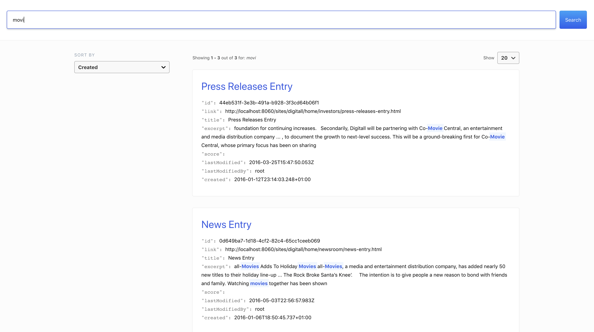

<!--
    Template for Readmes, see alternatives/examples here: https://github.com/matiassingers/awesome-readme
-->
<a href="https://www.jahia.com/">
    
</a>

Jahia Search UI Connector
======================

<!--
    A one-liner about the project, like a subtitle. For example: Jahia Digital Experience Manager Core
-->
<p align="center">A connector based on <a href="https://github.com/elastic/search-ui/tree/master/packages/search-ui-site-search-connector">Search UI Site Search Connector</a> by <a href="https://elastic.co">Elastic</a></p>

<!--
    A short technical description (not more than one paragraph) about the project, eventually with tech/tools/framework used.
-->
<p align="center">This connector aims at providing a compatibility layer between Jahia GraphQL API and Elastic Search-ui react components.</p>


## Installation
In order to use Search UI Jahia Connector, you simply need to add the `"@jahia/search-ui-jahia-connector": "^1.0.0"` package to the list of dependencies in your package.json

Then import the relevant components (described in detail below) in your app

## Usage
Interfacing with Jahia's GraphQL Search API is done by instantiating the
JahiaSearchAPIConnector object.

The following functionality is currently implemented:
* onSearch
* onAutocomplete
* Sort

#### Options
The following configuration is required in order for the custom request/response adaptors to work

| Param     | Type                | Description                                                                                                            |
| --------- | ------------------- | ---------------------------------------------------------------------------------------------------------------------- |
| **apiToken***   | <code>string</code> | [Jahia GraphQL API token](https://academy.jahia.com/documentation/developer/dx/7.3/headless-development-with-dx/headless-react-graphql-app-tutorial#Setting_up_authorization) |
| **baseURL***   | <code>string</code> | URL for Jahia server |
| **siteKey***   | <code>string</code> | Identifies which site search will be performed in |
| **language***  | <code>string</code> | The language in which to perform the search |
| **workspace*** | <code>string</code> | Specifies which workspace to perform search in `LIVE` or `DEFAULT` |
| **nodeType***  | <code>string</code> | Indexed document type to filter by (defaults to `jnt:page`) |


#### Result Field Configuration

Fields in result set are determined by a list of instantiated `Field` object

| Param     | Type                | Description                                                                                                            |
| --------- | ------------------- | ---------------------------------------------------------------------------------------------------------------------- |
| **type***   | <code>FieldType</code> | The type of field to return from search |
| **name***  | <code>string</code> | The JCR property name to retrieve |
| **alias** | <code>string</code> | Alternate name to be used in response |
| **useSnippet**  | <code>string</code> | Field rendering type; snippet (HTML) or raw (Plain text) |

#### Facet Configuration

There are 3 types of facets currently supported

* _Term_
* _Range_
* _Date Range_

##### Facet Object Configuration
| Param     | Type                | Description                                                                                                            |
| --------- | ------------------- | ---------------------------------------------------------------------------------------------------------------------- |
| **type***   | <code>string</code> | Type of facet [*value*\|*range*\|*date_range*] |
| **disjunctive**  | <code>boolean</code> | AND[*false*] or OR[*true*] operation |
| **ranges**** | <code>Array</code> | Array of range objects described below |

> **ranges** field is required for Date/Number range facet. Below is the structure:

 ```javascript
  let rangeExample = {
    //Label used for this range (required)
    name: 'jcr:lastModified',
    //At least `from` or `to` is required
    //Optional
    from: 'now-1M',
    //Optional
    to: 'now'
  }
 ```
> Note date_range value can be a date string or [date math expression](https://www.elastic.co/guide/en/elasticsearch/client/net-api/7.x/date-math-expressions.html) i.e _now-1M_

## Example

By following the guidelines below, you will be able to use JahiaSearchAPIConnector in your Search UI app.


Import the require classes to be used in Search UI's SearchProvider
```javascript
import JahiaSearchAPIConnector, {Field, FieldType} from '@jahia/search-ui-jahia-connector';
...
```
Instantiate the connector by providing the configuration of your server and search results.

Note* for testing purposes we will provide a fake string for apiToken. See connection options for how to generate the token.
```javascript
let connector = new JahiaSearchAPIConnector({
        apiToken: 'none',
        baseURL: 'http://localhost:8080',
        siteKey: 'digitall',
        language: 'en',
        workspace: 'LIVE',
        nodeType: 'jnt:page'
    });
```

Instantiate a list of fields to be returned from the search query
```javascript
let fields = [
    new Field(FieldType.HIT, 'link'),
    new Field(FieldType.HIT, 'displayableName', 'title'),
    new Field(FieldType.HIT, 'excerpt', null, true),
    new Field(FieldType.NODE, 'jcr:created', 'created')
    ...
];
```

Facets are configured by using the following structure
```javascript
let facets = {
  // Term Range Facet
  'jcr:keywords': {
    type: 'value',
    disjunctive: true
  },
  // Date Range Facet
  'jcr:lastModified': {
      type: 'date_range',
      disjunctive: true,
      ranges: [
        {
          from: 'now-1w',
          to: 'now',
          name: 'Last Week'
        },
        {
          from: 'now-1M',
          to: 'now',
          name: 'Last month'
        },
        {
          from: 'now-6M',
          to: 'now',
          name: 'Last 6 months'
        },
        {
          from: 'now-1y',
          to: 'now',
          name: 'Last year'
        }
      ]
  }
}
```

Define the configuration object for Search UI's `SearchProvider` components
```javascript
let config = {
        searchQuery: {
            //Set defined fields for search query
            result_fields: fields,
            facets: facets
        },
        autocompleteQuery: {
            results: {
                resultsPerPage: 10,
                //Set defined fields for autocomplete query
                result_fields: fields
            }
        },
        //Set the JahiaSearchAPIConnector connector that was defined above
        apiConnector: connector,
        hasA11yNotifications: true
    }
```
At this point you should have all bricks necessary to successfully use Jahia's Search UI Connector.